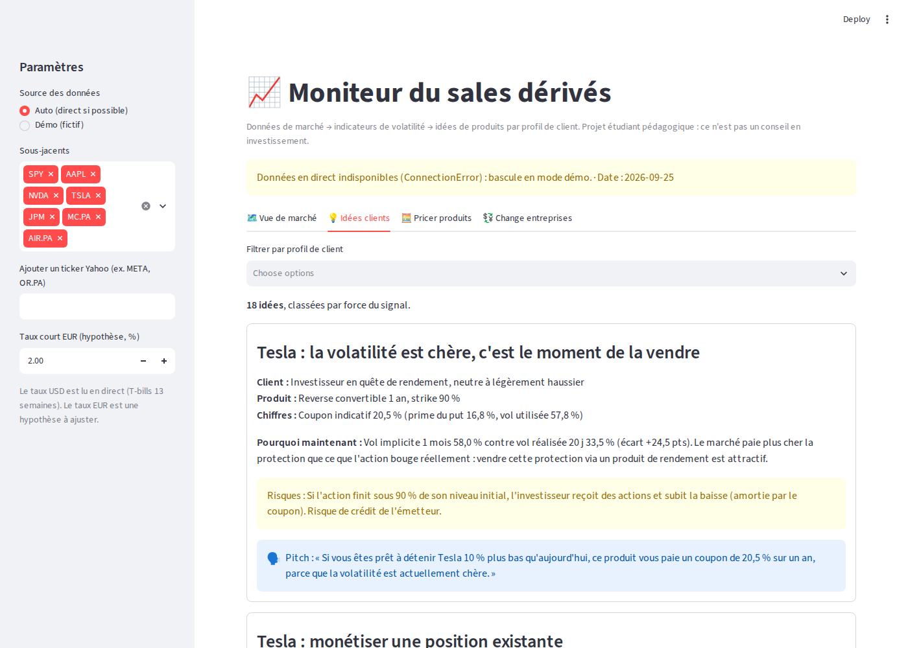
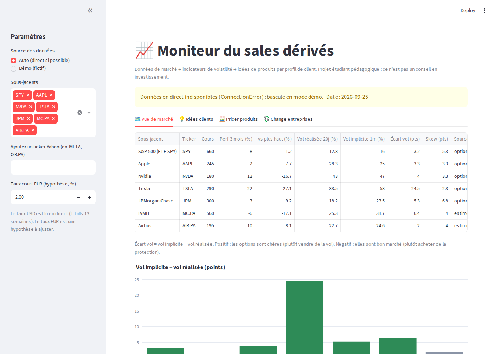
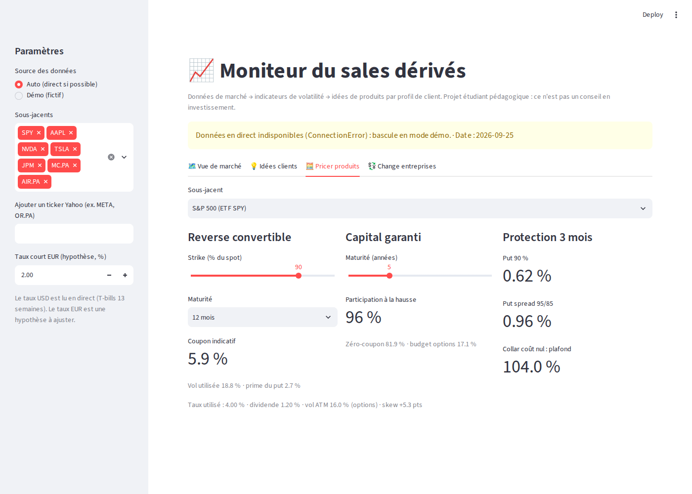
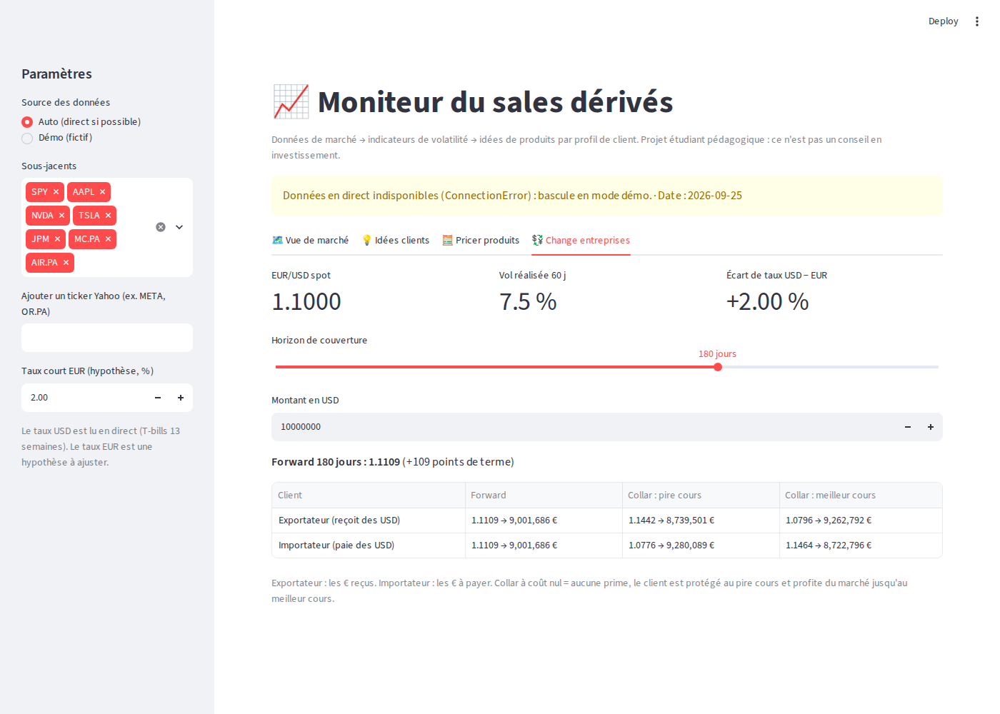
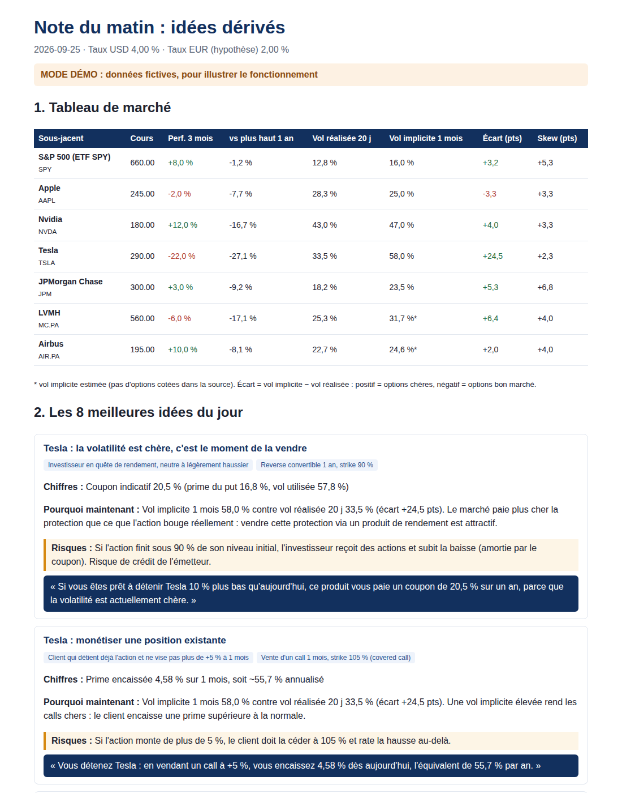

# Moniteur du sales dérivés

**Projet personnel en Python.** Une application qui lit les **données de marché en direct** (actions, options, change),
calcule les indicateurs qu'un desk regarde chaque matin (volatilité, skew…) et **propose automatiquement des idées
de produits dérivés adaptées à chaque profil de client**, avec les chiffres, les risques et le pitch à dire au téléphone.

C'est la suite de mon projet [Options Lab](https://github.com/eliote-daily98/options-lab) : là où Options Lab explique
*comment* marchent les produits, ce moniteur montre *quand* et *à qui* les proposer.

<p align="center"></p>

---

## En 30 secondes

| | |
|---|---|
| **Quoi ?** | Une application web (Streamlit) + une « note du matin » générée automatiquement. |
| **Données** | Yahoo Finance en direct (cours, chaînes d'options, taux US), gratuit et avec un léger différé. Sans connexion, l'appli bascule sur un **mode démo** aux données fictives, clairement signalé. |
| **Ce qu'elle fait** | 1) Tableau de marché : vol réalisée, vol implicite, skew, performance. 2) Idées par profil de client. 3) Pricer de produits. 4) Couverture de change pour les entreprises. |
| **Ce que ça montre** | Que je sais relier une lecture du marché à un besoin client et à un produit, ce qui est le cœur du métier de sales. |

---

## Comment le « sales » raisonne

L'appli applique des règles simples, celles qu'on apprend en cours de dérivés, sur des données réelles :

| Ce qu'on observe sur le marché | Ce que ça veut dire | Idée proposée | Pour quel client |
|---|---|---|---|
| **Vol implicite > vol réalisée** (+3 pts ou plus) | Les options sont chères : le marché surpaie la protection | Vendre de la vol : **reverse convertible**, **covered call** | Investisseur qui cherche du rendement, détenteur de l'action |
| **Vol implicite ≤ vol réalisée** | Les options sont bon marché | Acheter de la protection : **put**, **produit à capital garanti** | Détenteur inquiet, investisseur prudent |
| **Skew marqué** (put 90 % bien plus cher que l'ATM) | Les puts de strike bas sont chers | **Put spread** plutôt qu'un put sec (on revend le put cher) | Client qui veut se protéger à moindre coût |
| **Action proche de ses plus hauts** | Grosse plus-value latente à sécuriser | **Collar à coût nul** | Client qui ne veut pas vendre ses titres |
| **Forte baisse récente + vol élevée** | Coupons élevés, point d'entrée possible | **Reverse convertible strike 80 %** | Investisseur qui pense que la baisse est excessive |
| **Écart de taux EUR / USD** | Le cours à terme favorise l'importateur ou l'exportateur | **Forward** ou **collar de change** | Entreprises exportatrices et importatrices |

Chaque idée contient : **le client visé, le produit, les chiffres, pourquoi maintenant, les risques et le pitch.**

---

## Aperçu

| Vue de marché | Pricer de produits |
|---|---|
|  |  |
| **Couverture de change** | **Note du matin (HTML)** |
|  |  |

*Les captures sont en mode démo (données fictives).*

---

## Lancer l'application

```bash
pip install -r requirements.txt
streamlit run app.py              # ouvre l'application dans le navigateur
python -m desk.note               # génère note_du_matin.html (en direct si possible)
python -m desk.note --demo        # même chose avec les données fictives
pytest -q                         # 14 tests automatiques
```

Dans l'appli, la barre de gauche permet de choisir les sous-jacents (n'importe quel ticker Yahoo : `AAPL`, `MC.PA`, `OR.PA`…)
et le taux EUR.

## Petit lexique

| Terme | En une phrase |
|---|---|
| **Vol réalisée** | De combien l'action a réellement bougé ces 20 derniers jours (annualisé). |
| **Vol implicite** | De combien le marché *anticipe* qu'elle va bouger, lu dans le prix des options. |
| **Skew** | Écart de vol implicite entre un put de strike bas (90 %) et un put à la monnaie : mesure la peur d'une baisse. |
| **Reverse convertible** | Obligation + vente d'un put : gros coupon, mais le capital est à risque si l'action baisse. |
| **Capital garanti** | Zéro-coupon + call : pas de perte de capital, une partie de la hausse. |
| **Collar** | Achat d'un put + vente d'un call : un plancher et un plafond. |
| **Put spread** | Achat d'un put + vente d'un put plus bas : protection moins chère mais limitée. |

## Contenu du dépôt

| Fichier | Rôle |
|---|---|
| `app.py` | L'application web |
| `desk/data.py` | Connexion aux données : Yahoo Finance en direct, ou mode démo |
| `desk/analytics.py` | Calcul des indicateurs : vol réalisée, vol implicite recalculée à partir des prix d'options, skew, structure par terme |
| `desk/products.py` | Pricing des produits : reverse convertible, capital garanti, covered call, put, put spread, collar, forward et collar de change |
| `desk/advisor.py` | Le « sales » : règles qui transforment le marché en idées clients |
| `desk/note.py` | Génération de la note du matin |
| `tests/` | 14 tests (valeurs du Hull, vol implicite, collars à coût nul, adaptateur Yahoo simulé, bascule en mode démo…) |

## Limites (à dire honnêtement en entretien)
- Prix **indicatifs** calculés avec Black-Scholes : ils ne tiennent pas compte des marges réelles du desk ni du risque de crédit de l'émetteur.
- Yahoo Finance ne fournit presque pas d'options sur les actions européennes : pour `MC.PA`, `AIR.PA`… la vol implicite est **estimée** et l'appli le signale.
- Le taux EUR est une hypothèse saisie par l'utilisateur ; le taux USD est lu en direct.
- Données Yahoo Finance : usage personnel et pédagogique uniquement.

## Avertissement
Projet étudiant pédagogique. Les idées générées ne sont **ni des conseils en investissement ni des offres**.

## À propos
**Eliote Demaret**, étudiant à l'EDHEC Business School (Grande École, parcours finance).
Code écrit avec l'aide de l'IA (Claude) ; choix des règles de vente, vérification des résultats et analyse par moi.
